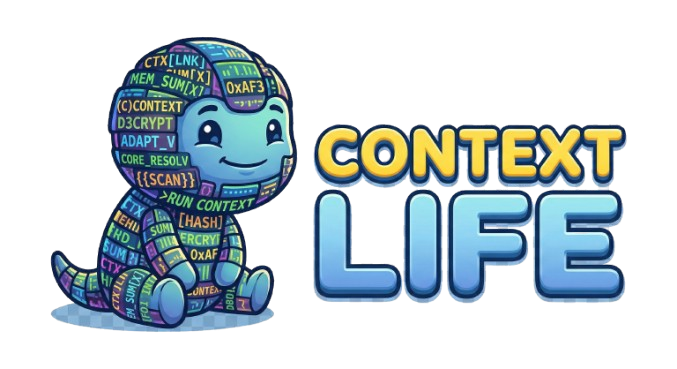

<p align="center">
  
</p>

<h1 align="center">Context-Life (CL)</h1>

<p align="center">
  <strong>LLM Context Optimization MCP Server</strong><br/>
  <em>Local RAG · Intelligent Trim · Token Counting · Prompt Caching · Context Health</em>
</p>

<p align="center">
  <a href="https://github.com/ErickGuerron/MCP-Context-Life/releases"></a>
  <a href="https://www.python.org/downloads/"></a>
  <a href="LICENSE.md"></a>
  <a href="https://modelcontextprotocol.io"></a>
</p>

<p align="center">
  Zero API calls — everything runs locally on your machine.
</p>

---

## ✨ What is Context-Life?

Context-Life is an **MCP server** that optimizes how LLMs use their context window. Think of **Contexty** (our mascot) as a little helper that sits between your AI client and the model, making sure every token counts.

- 🔢 **Token Counting** — Exact counts using tiktoken with LRU caching
- ✂️ **Smart Trimming** — Intelligent message array optimization that never drops system instructions
- 🔍 **Local RAG** — Semantic search over your files using LanceDB + multilingual embeddings
- 💾 **Prompt Caching** — Two-level prefix segmentation for maximum cache reuse
- 🏥 **Context Health** — Real-time health score (0-100) with actionable recommendations
- 🤖 **Orchestrator Detection** — Auto-detects Gentle AI, Engram, and MCP orchestrators

---

## 🚀 Install

### Using uv (Fastest & Recommended)

```bash
uv tool install "git+https://github.com/ErickGuerron/MCP-Context-Life.git"
```

<details>
<summary>Don't have <code>uv</code>? Install it first</summary>

- **Windows:** `powershell -ExecutionPolicy ByPass -c "irm https://astral.sh/uv/install.ps1 | iex"`
- **macOS / Linux:** `curl -LsSf https://astral.sh/uv/install.sh | sh`
</details>

### Using pipx

```bash
pipx install "git+https://github.com/ErickGuerron/MCP-Context-Life.git"
```

### Standard pip

```bash
pip install git+https://github.com/ErickGuerron/MCP-Context-Life.git
```

### Install Profiles

```bash
# Full install (default — includes RAG)
uv tool install "git+https://github.com/ErickGuerron/MCP-Context-Life.git"

# Core only (token counting + trim, no ML dependencies)
pip install "context-life[core]"

# With RAG (LanceDB + sentence-transformers)
pip install "context-life[rag]"

# Pinned to a specific version
uv tool install "git+https://github.com/ErickGuerron/MCP-Context-Life.git@v0.7.0"
```

### From Source

```bash
git clone https://github.com/ErickGuerron/MCP-Context-Life.git
cd MCP-Context-Life
pip install -e ".[dev]"
```

### Docker

```bash
docker build -t context-life .
docker run --rm context-life version
docker run --rm context-life info
docker run --rm context-life doctor
```

> [!WARNING]
> **Windows Users:** Windows locks running `.exe` files. If you get `[WinError 32]` during upgrade, close your MCP client first (OpenCode, Claude Desktop, Cursor, etc.).

---

## ⌨️ CLI Commands

```bash
context-life                           # Start MCP server (stdio)
context-life serve                     # Start MCP server (stdio)
context-life serve --http              # Start MCP server (HTTP)
context-life info                      # System info, config, dependencies
context-life doctor                    # Environment diagnostics
context-life warmup                    # Explain RAG warmup mode + current setting
context-life warmup set startup        # Persist warmup mode: lazy|startup|manual
context-life warmup interactive        # Interactive selector for warmup mode + prewarm
context-life prewarm                   # Explicitly warm the RAG model now
context-life upgrade                   # Upgrade to latest GitHub release
context-life upgrade --version v0.7.0  # Install specific version
context-life upgrade --dry-run         # Check without installing
context-life version                   # Show version
context-life help                      # Show help
```

---

## 🔧 Setup with MCP Clients

### OpenCode

Add to `~/.config/opencode/opencode.json`:

```json
{
  "mcp": {
    "context-life": {
      "type": "local",
      "command": ["context-life"],
      "enabled": true
    }
  }
}
```

### Claude Desktop

Edit `claude_desktop_config.json`:
- **Windows:** `%APPDATA%\Claude\claude_desktop_config.json`
- **macOS:** `~/Library/Application Support/Claude/claude_desktop_config.json`

```json
{
  "mcpServers": {
    "context-life": {
      "command": "context-life",
      "args": [],
      "env": {}
    }
  }
}
```

### Cursor / Windsurf / Gemini CLI

```json
{
  "mcpServers": {
    "context-life": {
      "command": "context-life"
    }
  }
}
```

---

## 🧰 Features

### Tools

| Tool | Description |
|------|-------------|
| `count_tokens_tool` | Count tokens for any text using tiktoken |
| `count_messages_tokens_tool` | Count tokens for OpenAI-style message arrays |
| `optimize_messages` | Trim message arrays using tail/head/smart strategies |
| `search_context` | Semantic search over indexed local knowledge |
| `index_knowledge` | Index local files into LanceDB for RAG retrieval |
| `cache_context` | Cache-aware message processing with segmented prefixes |
| `rag_stats` | Knowledge base statistics |
| `clear_knowledge` | Clear all indexed knowledge |
| `reset_token_budget` | Reset token budget tracker |
| `analyze_context_health_tool` | 🆕 Context health analysis with score, metrics & recommendations |
| `get_orchestration_advice` | 🆕 Actionable next-step contract for Gentle AI / MCP orchestrators |

### Resources

| Resource | Description |
|----------|-------------|
| `status://token_budget` | Current token budget + LRU cache stats |
| `cache://status` | Prompt cache hit/miss performance |
| `rag://stats` | RAG knowledge base info |
| `status://orchestrator` | 🆕 Detected orchestrator & advisor mode status |
| `status://orchestration` | 🆕 Static orchestration contract and recommended tool flow |

---

## 🏗️ Architecture

```
┌──────────────────────────────────────────────────┐
│            MCP Client (LLM Host)                 │
│    (OpenCode / Claude / Cursor / Gemini CLI)     │
└────────────────────┬─────────────────────────────┘
                     │ MCP Protocol (stdio/http)
┌────────────────────▼─────────────────────────────┐
│              Context-Life Server                  │
│                                                   │
│  ┌──────────────┐  ┌──────────────────────────┐  │
│  │ Config       │  │ Token Counter            │  │
│  │ (3-tier)     │  │ (tiktoken + LRU cache)   │  │
│  └──────────────┘  └──────────────────────────┘  │
│  ┌──────────────┐  ┌──────────────────────────┐  │
│  │ Trim History │  │ Cache Manager            │  │
│  │ (tail/head/  │  │ (2-level prefix +        │  │
│  │  smart)      │  │  advisor hints)          │  │
│  └──────────────┘  └──────────────────────────┘  │
│  ┌──────────────┐  ┌──────────────────────────┐  │
│  │ RAG Engine   │  │ Context Health           │  │
│  │ (LanceDB +   │  │ (score 0-100 +           │  │
│  │  lazy load)  │  │  recommendations)        │  │
│  └──────────────┘  └──────────────────────────┘  │
│  ┌──────────────┐  ┌──────────────────────────┐  │
│  │ Orchestrator │  │ CLI (Rich TUI)           │  │
│  │ Detector     │  │ (info/doctor/upgrade/    │  │
│  │ (auto-sense) │  │  version)                │  │
│  └──────────────┘  └──────────────────────────┘  │
└───────────────────────────────────────────────────┘
```

---

## 📖 How It Works

### Token Counter
Uses `tiktoken` for exact token counting. Supports `cl100k_base` (GPT-4, Claude), `o200k_base` (GPT-4o), and `p50k_base` (Codex). **v0.5.0:** LRU cache (1024 entries) eliminates redundant counts during trim iterations.

### Trim History
Three strategies with **strict budget guarantee**:
- **tail**: Keep the most recent messages
- **head**: Keep the oldest messages
- **smart**: Protect system messages + recent turns, compress the middle. If anchors exceed budget, compacts into a policy digest.

### RAG Engine
Local vector search using **LanceDB** (serverless) + **paraphrase-multilingual-MiniLM-L12-v2** (multilingual embeddings). **v0.5.0:** Lazy model loading eliminates cold start latency — the embedding model loads only on first use.
- Automatic deduplication by file hash
- Token-budgeted retrieval with skip-and-continue packing
- Per-source chunk limits (`max_chunks_per_source`)
- Score filtering (`min_score`)

### Cache Manager
Two-level prefix segmentation for optimal cache reuse:
- **Base prefix**: system/developer instructions (stable across turns)
- **RAG prefix**: injected knowledge context (may change)
- When only RAG changes, base prefix cache is preserved
- **v0.5.0:** Advisor hints injected when an AI orchestrator is detected

### Context Health *(v0.5.0)*
Real-time diagnostic tool that computes a health score (0-100) based on:
- Token utilization (% of budget consumed)
- Message redundancy (duplicate detection)
- System-to-user ratio (prompt domination)
- Noise estimation (trivial/empty messages)

Returns actionable recommendations and orchestrator hints for proactive context management.

### Orchestrator Detection *(v0.5.0)*
Auto-detects when CL runs alongside AI orchestrators like Gentle AI or Engram:
- **Environment variables**: `GENTLE_AI_ACTIVE`, `ENGRAM`, `MCP_ORCHESTRATOR`
- **Workspace artifacts**: `.gemini/`, `.gga`, `.agent/`, `.agents/`
- Enables "Advisor Mode" with proactive optimization hints

### Orchestration Advice *(vNext)*
Context-Life now exposes a first explicit orchestration contract for upstream orchestrators:
- `get_orchestration_advice` combines health + detection into actionable next steps
- `status://orchestration` advertises capabilities and a recommended tool flow
- Current integration level remains **heuristic-advisor** (not a bidirectional handshake yet)

---

## ⚙️ Configuration

Context-Life uses a three-tier configuration system:

1. **Built-in defaults** — always available
2. **Config file** — `~/.config/context-life/config.toml` (Linux/macOS) or `%APPDATA%\context-life\config.toml` (Windows)
3. **Environment variables** — `CL_*` prefix (highest priority)

### Config file example

```toml
[rag]
top_k = 5
min_score = 0.3
max_chunks_per_source = 3
chunk_size = 512
warmup_mode = "lazy"

[token_budget]
default = 128000
safety_buffer = 500

[trim]
preserve_recent = 6

[paths]
data_dir = "~/.local/share/context-life"
```

### Environment variables

```bash
export CL_RAG_TOP_K=10
export CL_RAG_WARMUP_MODE=startup
export CL_TOKEN_BUDGET_DEFAULT=64000
export CL_DATA_DIR=/custom/path
```

### RAG warmup modes

- `lazy` *(default)* — fast MCP startup, but the first RAG search/index pays the model load cost.
- `startup` — slower MCP startup because the model is prewarmed during boot, but first RAG use is faster.
- `manual` — never prewarms automatically; use `context-life prewarm` or the `prewarm_rag` MCP tool when you want to warm it explicitly.

If you prefer not to memorize commands, run `context-life warmup interactive` or open `context-life tui` and choose **RAG Warmup Selector**. From there you can inspect MCP impact, switch between `lazy` / `startup` / `manual`, and optionally trigger a manual prewarm immediately.

---

## 🧪 Development

```bash
# Run with HTTP transport for testing
context-life serve --http

# Or from source
python -m mmcp serve --http

# Lint
ruff check mmcp/

# Test
pytest

# Skip slow RAG integration tests
pytest -m "not slow"

# Run performance-oriented smoke/stress tests
pytest -m performance
```

---

## 📋 Requirements

- Python >= 3.10
- ~500MB disk for sentence-transformers model (downloaded once on first use)
- No GPU required — runs on CPU

## 📄 License

[MIT License](LICENSE.md)

---

<p align="center">
  <sub>Built with ❤️ by <a href="https://github.com/ErickGuerron">Erick Guerrón</a></sub>
</p>
